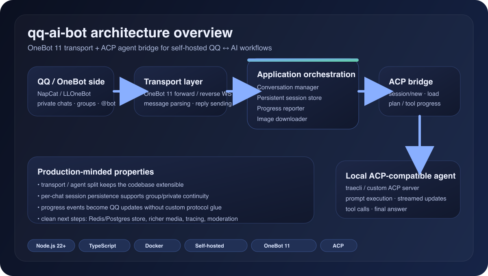
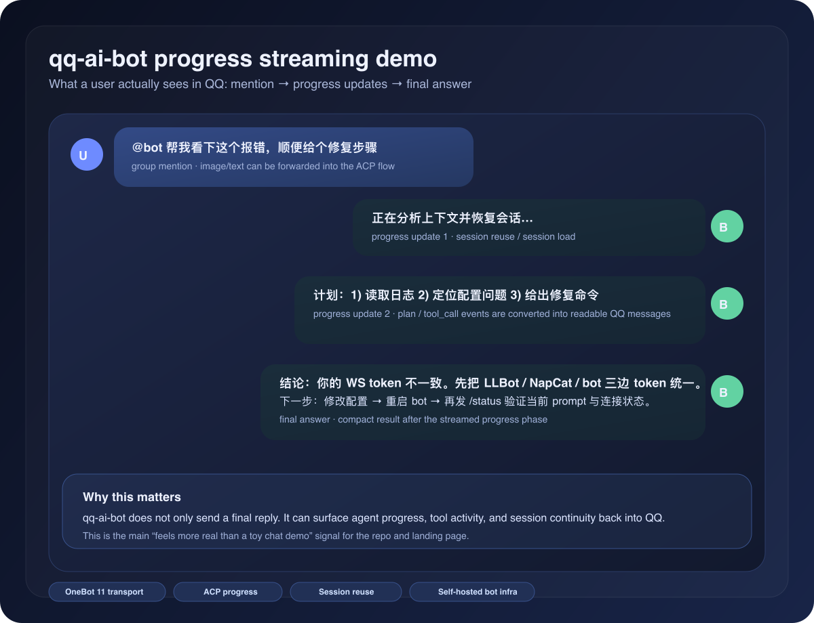

# qq-ai-bot

[](https://github.com/happysnaker/qq-ai-bot/actions/workflows/ci.yml)
[](https://github.com/happysnaker/qq-ai-bot/releases)
[](https://github.com/happysnaker/qq-ai-bot/stargazers)
[](https://github.com/happysnaker/qq-ai-bot/generate)
[](https://happysnaker.github.io/qq-ai-bot/)
[](https://happysnaker.github.io/support/#from-qq-ai-bot)

一个面向实际部署的 **QQ ↔ AI** 机器人项目。

`qq-ai-bot` 基于 **OneBot 11** 接入 QQ，基于 **ACP** 对接本地 agent，并将结果、会话状态和处理中进度返回到 QQ。它不绑定某一个特定 agent：只要你的 agent 能以 ACP 方式启动和通信，就可以挂到这个机器人后面。

> **English pitch:** A production-grade, self-hosted **QQ ↔ AI bridge** for **OneBot 11 / NapCat / LLOneBot** and **ACP-compatible agents**, with persistent sessions, progress streaming, and a Docker demo stack.

- 项目页：[happysnaker.github.io/qq-ai-bot](https://happysnaker.github.io/qq-ai-bot/)
- 5 分钟演示：[Docker 快速演示](docs/docker-quickstart.md)
- 架构说明：[ARCHITECTURE.md](./ARCHITECTURE.md)
- 路线图：[ROADMAP.md](./ROADMAP.md)
- 参与贡献：[CONTRIBUTING.md](./CONTRIBUTING.md)
- 安全反馈：[SECURITY.md](./SECURITY.md)
- 想直接拿来改成你自己的 bot 脚手架：点 GitHub 上方的 **Use this template**
- 技术栈：Node.js 22+、TypeScript、Docker、GitHub Actions
- 适用场景：自托管 QQ bot、NapCat / LLOneBot 集成、ACP agent 接线层




> 如果这个仓库帮你省掉了 OneBot 接线、会话管理或 ACP bridge 的搭建时间，欢迎给个 star，或者直接支持我的开源维护：[happysnaker.github.io/support](https://happysnaker.github.io/support/#from-qq-ai-bot)

## 核心能力



- OneBot 11 forward / reverse WebSocket
- 兼容 NapCat / LLOneBot
- 私聊、群聊独立会话
- 群聊支持仅 `@机器人` 触发
- 每个群独立 `systemPrompt`
- `/help` `/status` `/prompt` `/reset` `/ping`
- ACP 会话复用与持久化
- 处理中进度回传到 QQ
- 入站图片下载后转给 agent
- Prometheus 风格 `/metrics` 与 runtime counters
- `/readyz` / `/status` 中暴露 build / version 信息
- 可插拔 session store（默认 file，支持 Redis）
- macOS 下提供 NapCat 接入辅助脚本

## 快速开始

### 0. 想先 5 分钟跑通？先用 Docker 演示栈

仓库自带了一个 **NapCat + qq-ai-bot + mock ACP agent** 的最小演示栈：

```bash
cp .env.docker.example .env.docker
docker compose -f docker-compose.demo.yml up -d --build
```

然后：

- 打开 `http://127.0.0.1:6099/webui`
- 默认 WebUI token：`napcat`
- 给机器人发 `/ping` 或 `/status`

这套演示默认跑的是仓库内置 mock ACP agent，适合先验证 **QQ → OneBot → qq-ai-bot → ACP bridge** 链路是否打通。完整说明见 [Docker 快速演示](docs/docker-quickstart.md)。

### 1. 准备环境

- Node.js 22+
- 一个 OneBot 11 实现（推荐 [NapCatQQ](https://github.com/NapNeko/NapCatQQ) 或 [LLOneBot](https://github.com/LLOneBot/LuckyLilliaBot)）
- 一个 ACP 兼容 agent

如果你还没决定接哪个 agent，先看 [ACP Agent 接入](docs/agent-integration.md)。里面给了三种可直接用的方式：仓库自带 mock agent、`traecli` 示例、以及自定义 agent 配置。

### 2. 拉代码并准备配置

```bash
git clone https://github.com/happysnaker/qq-ai-bot.git
cd qq-ai-bot
npm install
cp .env.example .env
cp examples/group-rules.example.json examples/group-rules.local.json
```

项目启动时会自动读取项目根目录下的 `.env`。

你真正要修改的是：

- 项目根目录下的 `.env`
- 项目根目录下的 `examples/group-rules.local.json`

最重要的 ACP 配置是这三项：

```env
ACP_AGENT_COMMAND=your-acp-agent-command
ACP_AGENT_ARGS_JSON=[]
ACP_AGENT_WORKDIR=/path/to/your/workdir
```

### 3. 先测 agent，再接 QQ

先确认 bot 能拉起你配置的 ACP agent：

```bash
npm run smoke:agent
```

看到输出里包含 `ACP_SMOKE_OK` 后，再启动 bot：

```bash
npm run dev
```

然后把你的 OneBot 11 reverse WebSocket 指到：

```text
ws://127.0.0.1:16700/onebot/v11/ws
```

## 文档

- [Docker 快速演示](docs/docker-quickstart.md)
- [快速开始](docs/getting-started.md)
- [ACP Agent 接入](docs/agent-integration.md)
- [配置说明](docs/configuration.md)
- [macOS 接入 NapCat](docs/macos-napcat.md)
- [Windows 接入说明（未验证）](docs/windows-untested.md)
- [架构说明](ARCHITECTURE.md)

## 命令

- `/help`
- `/status`
- `/prompt`
- `/reset`
- `/ping`

## 外部项目 / 协议

- [NapCatQQ](https://github.com/NapNeko/NapCatQQ)
- [LLOneBot](https://github.com/LLOneBot/LuckyLilliaBot)
- [OneBot 11](https://11.onebot.dev)

## 平台说明

- **macOS**：仓库内置了 NapCat 辅助脚本。
- **Windows**：提供接入说明，但当前标记为 **未验证**。
- **Linux**：bot 侧本身没有特殊限制。

## Roadmap / Help wanted

如果你想看这个仓库下一步会往哪走，或者想直接认领一个更偏工程化的贡献方向，先看：

- [ROADMAP.md](./ROADMAP.md)
- [Discussions](https://github.com/happysnaker/qq-ai-bot/discussions)
- [`help wanted` issues](https://github.com/happysnaker/qq-ai-bot/issues?q=is%3Aopen+label%3A%22help+wanted%22)

当前优先方向：

- richer media / 附件处理
- tracing / 更细的 observability 信号
- 多实例部署与更多外部存储路径
- 更多 channel / transport 演进

如果你准备提 PR，建议先看 [CONTRIBUTING.md](./CONTRIBUTING.md)。

## Community

- **Questions / usage help**：用 [Q&A discussions](https://github.com/happysnaker/qq-ai-bot/discussions/categories/q-a)
- **Feature / roadmap ideas**：用 [Ideas discussions](https://github.com/happysnaker/qq-ai-bot/discussions/categories/ideas)
- **具体可认领任务**：看 [`help wanted` issues](https://github.com/happysnaker/qq-ai-bot/issues?q=is%3Aopen+label%3A%22help+wanted%22)
- **直接支持仓库**：看 [SUPPORT.md](./SUPPORT.md)

## Support

如果这个仓库帮你省掉了 OneBot 接线、会话管理或 ACP bridge 的搭建时间：

- 给仓库点个 star
- 提 issue / PR 补充更多 channel、session store 或 observability 能力
- 直接支持我的开源维护：[happysnaker.github.io/support](https://happysnaker.github.io/support/#from-qq-ai-bot)
- 如果你是因为这个项目来的，付款备注最有用的是：`qq-ai-bot`
- 如果你想让我先 blunt 地看一眼你自己的 bot / agent / infra 仓库，可直接发这个模板：[¥29.9 Quick read | repo link](mailto:happysnaker@foxmail.com?subject=Quick%20read%20%7C%20bot%20repo%20link&body=Repo%20link%3A%0AWhat%20feels%20weak%3A%20README%20/%20positioning%20/%20landing%20page%0APayment%20screenshot%3A%20attached)
- 如果你想要更完整的 GitHub / README / landing-page 包装 pass，可直接发这个模板：[¥99 Async review | repo link](mailto:happysnaker@foxmail.com?subject=Async%20review%20%7C%20bot%20repo%20link&body=Repo%20link(s)%3A%0ATarget%20role%20or%20use%20case%3A%0AWhat%20feels%20weak%3A%20README%20/%20positioning%20/%20landing%20page%20/%20GitHub%20profile%0APayment%20screenshot%3A%20attached)
- 如果你想把自己的 bot / agent / infra 仓库也整理成这种更像成品的状态，可看轻量付费反馈：[happysnaker.github.io/review](https://happysnaker.github.io/review/)
